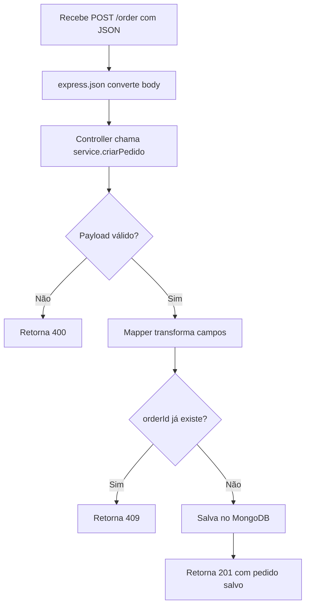

## Tecnologias usadas
<p align="center">  
  
  
  
  
</p>
- Node.js

- JavaScript CommonJS

- Express

- MongoDB

- Mongoose

- Swagger (`swagger-jsdoc` + `swagger-ui-express`)

- Docker Compose (MongoDB + Mongo Express)
## Pré-requisitos

- Node.js 18+ (recomendado)

- npm

- Docker e Docker Compose
## Como executar
1. Instale as dependências do projeto:
```bash

npm install

```
2. Suba o banco MongoDB com Docker:
```bash

docker compose up -d

```
3. Inicie a API:
```bash

npm start

```
4. Acesse:

- API: `http://localhost:3000`

- Swagger: `http://localhost:3000/api-docs`

- Mongo Express: `http://localhost:8081`
## Endpoints principais
- `POST /order`

- `GET /order/list`

- `GET /order/:id`

- `PUT /order/:id`

- `DELETE /order/:id`

# Notas teste tecnico
Abaixo estão anotações e tutorial que usei no processo de criação do projeto.
## Tarefas

- [x]  setup Node.js + Express
- [x]  git + .gitignore
- [x]  iniciar commites locais 
- [x]  estrutura base (app.js, server.js)
- [x]  API rodando na porta 3000
- [x]  MongoDB com conexão funcionando
- [x]  model de pedido com itens
- [x]  mapper de entrada para modelo interno
- [x]  rotas, controller, service e repository
- [x]  separação de responsabilidades
- [x]  CRUD de pedidos (create, read, list, update, delete)
- [x]  validação de payload
- [x]  respostas HTTP corretas (201, 200, 204, 404, 409, 500)
- [x]  tratamento consistente com try/catch
- [x]  Swagger em /api-docs
- [x]  Arquivo de Readme
- [x]  subir repositório público no GitHub
## Fluxograma de POST pedido


# Endpoint de criar pedido 
Aqui é como ficou o endpoint de criar pedido 


Primeiro usamos o Try para tentar enviar o pedido caso não dê erro ele vai direto para o 201 enviando o json do pedido.
Caso dê algum erro ele irá cair dentro do catch que irá tratar qual tipo de erro usando *erro.statusCode*.
E caso tudo de errado ele irá cair dentro do status 500 para avisar o usuário. 
## Como criar um pedido
Utilizamos a documentação do swagger para criar um novo pedido em
URL: http://localhost:3000/order 


Que retorna:


E caso por algum problema seja passado novamente um produto com o mesmo id ele gera um erro e não deixa salvar em banco. Com erro 409


Aqui vemos em pedidoService.js 


Que criamos a variável *pedidoExistente* que busca lá no banco se já existe algum produto ou no caso order com ID e se for True a variavel vai segurar esse valor para ser usada na condição if(pedidoExistente) que caso for true vai lançar o throw Error.

# Endpoint de obter dados do pedido por id no parâmetro
Primeiro temos em routes que recebe id no parâmetro da requisição
"http://localhost:3000/order/ID"


Aqui no repository usa o id para buscar no banco.


Depois no controller usamos try para buscar o pedido via id caso for algo totalmente diferente de pedido ele cai no erro 404.


## Como pesquisar um pedido via parâmetro na URL
Aqui na URL: http://localhost:3000/order/v10089016vdb
testamos com parâmetro direto e ele nos retorna o json


# Endpoint de listar todos pedidos
Aqui temos o repository para listar todos pedidos do banco


Aqui temos nosso controller que retorna os pedidos e caso de algum erro retorna 500


E aqui a rota /list para listar todos os pedidos


## Como listar os pedidos
Em acessamos o endpoint http://localhost:3000/order/list  e ele já retorna o json com todos os pedidos em banco


# Como atualizar pedido via parâmetro na url
Em http://localhost:3000/order/v10089016vdb usando o swagger usamos o método PUT para editar um pedido via parâmetro da url com o id do pedido.


E agora nosso pedido que tinha quantidade de 1 tem agora 2


# Como excluir um pedido via parâmetro na url
Em: http://localhost:3000/order/v10089016vdb usamos o swagger para usar o método DELETE


E o retorno 204 de sucesso.


# Armazenamento dos dados
Usei o Mongodb em docker e o mongo express para poder acessar os dados do banco via interface web.
## Configuração docker compose
Aqui vemos minha config para subir um banco de dados mongo na versão 7 na porta 27017 com persistência em dados do db. E em baixo vemos o mongo express na porta 8081.


## Interface web do mongo express
Em: http://localhost:8081/db/pedidos/pedidos veja nossos pedidos no banco.


Aqui se abrir um pedido específico


# Validação de pedidos e Mapping
Primeiro a validação em pedidoService.js temos a função validarPedido que recebe o corpo da requisição compara se é um tipo de dado object caso contrario cai no throw error e força um 400 ou se for invalido retorna pedindo para escrever os campos obrigatórios 

 

Em pedidoMapper.js recebe o object json e fazemos mapeamento de numeroPedido para orderID, valorTotal para value, etc.
Para conseguirmos salvar no banco de dados. 
Basicamente pegamos um json fora da formatação para formatar para salvar em banco de dados. 


# Documentação da API e configurações do Swagger
Em docs podemos acessar a configuração do swagger


Para acessar basta entrar em:
http://localhost:3000/api-docs/


